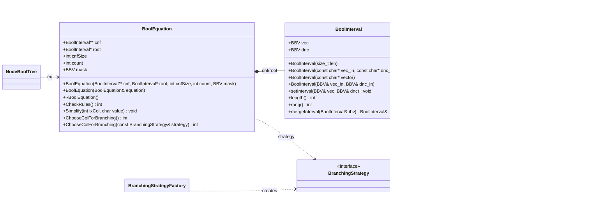

# Лабораторная работа по предмету: "Разработка средств защиты информации"
## Тема: "Интеграция механизма аллокции памяти с фиксированными блоками на C++,  в реализуемое приложение"
> 4 курс 2 семестр \
> Студент группы 932223 - **Артеменко Антон Дмитриевич** 

## 1. Постановка задачи
> Рассмотреть пользовательский проект. В пользовательском проекте обеспечить работу c памятью. через Allocator.  Обеспечить архитектурную возможность изменения правила выбора переменной ветвления (использовать паттерн "Стратегия") для SAT задачи.

> Исследовать пользовательский проект на уязвимости с помощью любого доступного статического анализатора, например pvs-studio , а также с помощью  Valgrind динамического анализа. По результатам исследования подготовить отчет и прикрепить в качестве ответа. 

## 2. Предлагаемое решение
### Зависимости проекта
В проекте используется:
- **CMake** v3.12
- **Стандарт C++** 17
- **(Allocator)[https://github.com/endurodave/Allocator.git]**

## UML-диаграмма классов

### Архитектура решения
Основные компоненты:
- **main.cpp** — точка входа приложения. Считывает исходные данные SAT-задачи, строит КНФ, создает `BoolEquation` и запускает DPLL-поиск.
- **BBV** — битовый вектор, используемый для хранения булевых значений, масок и представления интервалов.
- **BoolInterval** — класс интервала булевой функции; хранит вектор значений и don't-care маску, поддерживает операции сравнения, объединения и упрощения.
- **BoolEquation** — модель SAT-задачи. Хранит КНФ, корневой интервал, маску столбцов и реализует правила упрощения, выбор столбца ветвления и работу с пользовательским аллокатором.
- **BranchingStrategy** — интерфейс стратегии выбора переменной ветвления.
	- **FirstFreeColumnBranchingStrategy** — выбирает первый свободный столбец.
	- **MinDontCareBranchingStrategy** — выбирает столбец с минимальным числом символов `-`.
- **BranchingStrategyFactory** — создает нужную стратегию по имени и позволяет менять правило ветвления без изменения логики решателя.
- **NodeBoolTree** — узел дерева поиска, связывает текущее состояние уравнения с левым и правым поддеревом.

Таким образом, проект разделен на три слоя: представление данных (`BBV`, `BoolInterval`), логика SAT-решателя (`BoolEquation`, `NodeBoolTree`) и стратегия выбора ветвления (`BranchingStrategy` и ее реализации).


## 3. Инструкция для пользователя
Сборка проекта производится следующим образом:

<details>
<summary>Windows</summary>

Создайте директорию `build` и перейдите в нее:
```powershell
mkdir build
cd build
```

Сконфигурируйте и соберите проект:
```powershell
cmake .. && cmake --build .
```
Запустите программу:
```powershell
.\development_of_information_security_tools_lab_2.exe
```

После запуска программа запросит пароль в консоли.

Ограничение на пароль: не более 100 символов.

</details>

<details>
<summary>Linux / macOS</summary>

Создайте директорию `build` и перейдите в нее:
```bash
mkdir -p build && cd build
```

Сконфигурируйте и соберите проект:
```bash
cmake ..
cmake --build .
```

Запустите программу:
```bash
./development_of_information_security_tools_lab_2
```
