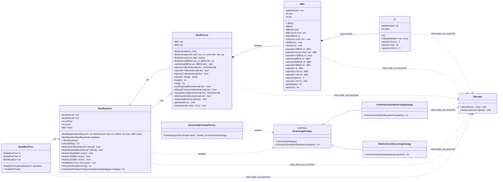

# Лабораторная работа по предмету: "Разработка средств защиты информации"
## Тема: "Интеграция механизма аллокции памяти с фиксированными блоками на C++,  в реализуемое приложение"
> 4 курс 2 семестр \
> Студент группы 932223 - **Артеменко Антон Дмитриевич** 

## 1. Постановка задачи
> Рассмотреть пользовательский проект. В пользовательском проекте обеспечить работу c памятью. через Allocator.  Обеспечить архитектурную возможность изменения правила выбора переменной ветвления (использовать паттерн "Стратегия") для SAT задачи.

> Исследовать пользовательский проект на уязвимости с помощью любого доступного статического анализатора, например pvs-studio , а также с помощью  Valgrind динамического анализа. По результатам исследования подготовить отчет и прикрепить в качестве ответа. 

## 2. Предлагаемое решение
### Зависимости проекта
В проекте используется:
- **CMake** v3.12
- **Стандарт C++** 17
- **Allocator**: https://github.com/endurodave/Allocator.git
## UML-диаграмма классов

### Архитектура решения
Основные компоненты:
- **main.cpp** — точка входа приложения. Считывает исходные данные SAT-задачи, строит КНФ, создает `BoolEquation` и запускает DPLL-поиск.
- **BBV** — битовый вектор, используемый для хранения булевых значений, масок и представления интервалов.
- **BoolInterval** — класс интервала булевой функции; хранит вектор значений и don't-care маску, поддерживает операции сравнения, объединения и упрощения.
- **BoolEquation** — модель SAT-задачи. Хранит КНФ, корневой интервал, маску столбцов и реализует правила упрощения, выбор столбца ветвления и работу с пользовательским аллокатором.
- **BranchingStrategy** — интерфейс стратегии выбора переменной ветвления.
	- **FirstFreeColumnBranchingStrategy** — выбирает первый свободный столбец.
	- **MinDontCareBranchingStrategy** — выбирает столбец с минимальным числом символов `-`.
- **BranchingStrategyFactory** — создает нужную стратегию по имени и позволяет менять правило ветвления без изменения логики решателя.
- **NodeBoolTree** — узел дерева поиска, связывает текущее состояние уравнения с левым и правым поддеревом.

Таким образом, проект разделен на три слоя: представление данных (`BBV`, `BoolInterval`), логика SAT-решателя (`BoolEquation`, `NodeBoolTree`) и стратегия выбора ветвления (`BranchingStrategy` и ее реализации).

### Конфигурация пользовательского аллокатора (Allocator)
Проект использует пользовательский аллокатор на базе библиотеки https://github.com/endurodave/Allocator для оптимизации управления памятью. Каждый класс, использующий аллокатор, объявляется через макрос `DECLARE_ALLOCATOR` в заголовочном файле и реализуется через `IMPLEMENT_ALLOCATOR(ClassName, poolSize, memoryPtr)` в .cpp файле.

#### Синтаксис и параметры IMPLEMENT_ALLOCATOR

```cpp
IMPLEMENT_ALLOCATOR(ClassName, poolSize, memoryPtr)
```

Где:
- **ClassName** — имя класса, для которого создается аллокатор
- **poolSize** — размер пула предварительно выделенных объектов:
  - `0` — динамическое выделение памяти (объекты выделяются по мере необходимости)
  - `N > 0` — фиксированный пул из N объектов (выделяется при инициализации)
- **memoryPtr** — источник памяти для пула:
  - `0` или `NULL` — выделять из кучи (heap)
  - указатель на статическую память — использовать предоставленный буфер

#### Примеры конфигураций в проекте

| Класс | Конфигурация | Паттерн использования | Обоснование |
|-------|--------------|----------------------|-------------|
| `FirstFreeColumnBranchingStrategy` | `(1, 0)` | Синглтон — 1 экземпляр на весь запуск программы | Стратегия выбирается один раз при старте и переиспользуется на протяжении всего поиска |
| `MinDontCareBranchingStrategy` | `(1, 0)` | Синглтон — 1 экземпляр на весь запуск программы | Стратегия выбирается один раз при старте и переиспользуется на протяжении всего поиска |
| `BoolEquation` | `(0, 0)` | Экспоненциальный рост — создаются копии при ветвлении | Количество объектов растет экспоненциально по глубине дерева поиска (2^depth), размер пула неизвестен на момент компиляции |
| `NodeBoolTree` | `(0, 0)` | Экспоненциальный рост — узлы дерева поиска | Дерево поиска DPLL растет экспоненциально; каждый узел создает до 2 дочерних |
| `BoolInterval` | `(0, 0)` | Переменное количество — зависит от размера КНФ | Количество копий зависит от размера входной КНФ и глубины поиска |
| `BBV` | `(0, 0)` | Внутреннее использование — 2-3 экземпляра | Вспомогательный класс с низким темпом выделения |
| `X` | `(0, 0)` | Прокси-доступ — временные объекты | Внутренний прокси-класс для доступа к элементам BBV |

#### Когда использовать (1, 0) vs (0, 0)

**Используйте `(1, 0)` когда:**
- Объект создается один раз и переиспользуется (синглтон-паттерн)
- Можно предвычислить точное количество экземпляров
- Нужно избежать повторного выделения памяти

**Используйте `(0, 0)` когда:**
- Количество объектов неизвестно на момент компиляции
- Объекты растут экспоненциально или в зависимости от входных данных
- Статический пул был бы неэффективен по памяти


## 3. Инструкция для пользователя
Сборка проекта производится следующим образом:

<details>
<summary>Windows</summary>

Создайте директорию `build` и перейдите в нее:
```powershell
mkdir build
cd build
```

Сконфигурируйте и соберите проект:
```powershell
cmake .. && cmake --build .
```
Запустите программу:
```powershell
.\development_of_information_security_tools_lab_2.exe <PATH> min-dont-care
```


</details>

<details>
<summary>Linux / macOS</summary>

Создайте директорию `build` и перейдите в нее:
```bash
mkdir -p build && cd build
```

Сконфигурируйте и соберите проект:
```bash
cmake ..
cmake --build .
```

Запустите программу:
```bash
./development_of_information_security_tools_lab_2 <PATH> min-dont-care
```

Поддерживаемые стратегии ветвления:
- `min-dont-care` или `min`
- `first-free` или `first`

## 4. Тестирование
Для проверки работы решателя в проекте подготовлен набор входных файлов в каталоге `SatExamples`.

Варианты запуска тестов:
```bash
./development_of_information_security_tools_lab_2 ../SatExamples/sat_ex_1.pla min-dont-care
./development_of_information_security_tools_lab_2 ../SatExamples/sat_ex_1.pla first-free
```
