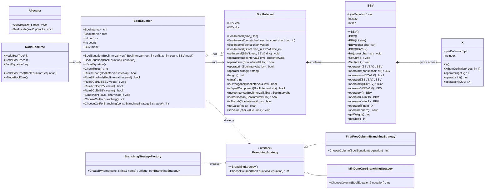

# Лабораторная работа по предмету: "Разработка средств защиты информации"
## Тема: "Интеграция механизма аллокции памяти с фиксированными блоками на C++,  в реализуемое приложение"
> 4 курс 2 семестр \
> Студент группы 932223 - **Артеменко Антон Дмитриевич** 

## 1. Постановка задачи
> Рассмотреть пользовательский проект. В пользовательском проекте обеспечить работу c памятью. через Allocator.  Обеспечить архитектурную возможность изменения правила выбора переменной ветвления (использовать паттерн "Стратегия") для SAT задачи.

> Исследовать пользовательский проект на уязвимости с помощью любого доступного статического анализатора, например pvs-studio , а также с помощью  Valgrind динамического анализа. По результатам исследования подготовить отчет и прикрепить в качестве ответа. 

## 2. Предлагаемое решение
### Зависимости проекта
В проекте используется:
- **CMake** v3.12
- **Стандарт C++** 17
- **Allocator**: https://github.com/endurodave/Allocator.git
## UML-диаграмма классов

### Архитектура решения
Основные компоненты:
- **main.cpp** — точка входа приложения. Считывает исходные данные SAT-задачи, строит КНФ, создает `BoolEquation` и запускает DPLL-поиск.
- **BBV** — битовый вектор, используемый для хранения булевых значений, масок и представления интервалов.
- **BoolInterval** — класс интервала булевой функции; хранит вектор значений и don't-care маску, поддерживает операции сравнения, объединения и упрощения.
- **BoolEquation** — модель SAT-задачи. Хранит КНФ, корневой интервал, маску столбцов и реализует правила упрощения и выбор столбца ветвления.
- **BranchingStrategy** — интерфейс стратегии выбора переменной ветвления.
	- **FirstFreeColumnBranchingStrategy** — выбирает первый свободный столбец.
	- **MinDontCareBranchingStrategy** — выбирает столбец с минимальным числом символов `-`.
- **BranchingStrategyFactory** — создает нужную стратегию по имени и позволяет менять правило ветвления без изменения логики решателя.
- **NodeBoolTree** — узел дерева поиска, связывает текущее состояние уравнения с левым и правым поддеревом.

Таким образом, проект разделен на три слоя: представление данных (`BBV`, `BoolInterval`), логика SAT-решателя (`BoolEquation`, `NodeBoolTree`) и стратегия выбора ветвления (`BranchingStrategy` и ее реализации).

### Пользовательский аллокатор (Allocator)

#### Что это
[endurodave/Allocator](https://github.com/endurodave/Allocator) — библиотека из одного класса `Allocator`, реализующего пул блоков **фиксированного размера** на базе free-list. Операции `Allocate`/`Deallocate` работают за O(1), внутри пула не возникает фрагментации, а источник памяти задается явно при создании пула.

#### Способы использования

Аллокатор поддерживает два равноценных способа подключения.

**1. Через макросы**

В заголовке класса ставится `DECLARE_ALLOCATOR`, в `.cpp` — `IMPLEMENT_ALLOCATOR(ClassName, poolSize, memoryPtr)`:

```cpp
// header
class Foo {
  DECLARE_ALLOCATOR
};

// source
IMPLEMENT_ALLOCATOR(Foo, poolSize=0, memoryPtr=0)
```

Где `poolSize` — число объектов в пуле (`0` — без верхней границы, блоки берутся из кучи по требованию; `N > 0` — фиксированный пул на N объектов), а `memoryPtr` — источник памяти (`0`/`NULL` — куча; указатель — внешний статический буфер). После подключения любой `new Foo`/`delete Foo` идет через указанный. Подходит, когда нужен один общий пул на класс и не хочется править места создания объектов.

**2. Прямое использование инстанса.**
Создается явный объект `Allocator` и вызываются `Allocate`/`Deallocate` руками:

```cpp
Allocator pool(sizeof(T), N, memory=nullptr, "T-pool");
void* mem = pool.Allocate(sizeof(T));
T* obj   = new (mem) T(...);
obj->~T();
pool.Deallocate(obj);
```

Либо через шаблон-обертку со встроенным статическим буфером:

```cpp
AllocatorPool<T, N> pool;   // внутри держит CHAR m_memory[sizeof(T) * N]
```

Подходит, когда нужно несколько разных пулов на один класс, ручное управление временем жизни пула.

#### Режимы работы (AllocatorMode)

Режим выбирается комбинацией параметров конструктора `Allocator(size, objects, memory)`:

| Режим | Параметры конструктора | Источник памяти | Поведение | Когда применять |
|-------|-----------------------|-----------------|-----------|-----------------|
| `HEAP_BLOCKS` | `objects = 0`, `memory = NULL` | Куча| Каждый новый блок берется из кучи отдельным вызовом, освобожденные блоки попадают в free-list и переиспользуются. Память не возвращается ОС до уничтожения аллокатора. | Верхняя граница числа объектов неизвестна; нужно снизить нагрузку на системный heap за счет переиспользования блоков |
| `HEAP_POOL` | `objects = N > 0`, `memory = NULL` | Куча | Сразу резервируется `N * blockSize` байт; дальше работа идет без обращений к heap | Известна верхняя граница; нужна предсказуемая стоимость выделения и хорошая локальность данных |
| `STATIC_POOL` | `objects = N > 0`, `memory = &buf[0]` | Внешний буфер | Никаких обращений к куче; пользователь сам владеет памятью | Embedded-сценарии, запреты на динамическую память, детерминированные тесты |

Во всех режимах `blockSize` фиксирован — один экземпляр `Allocator` обслуживает объекты ровно одного размера.

#### Текущее использование в проекте

- создаются три инстанса (`HEAP_BLOCKS`, `HEAP_POOL`, `STATIC_POOL`) над одинаковым `blockSize`;
- функция `RunAllocatorBenchmarks()` сравнивает их со штатным `new[]`/`delete[]` на одинаковой нагрузке и выводит время каждого режима;
- сами классы решателя продолжают использовать стандартный `new`/`delete`. На случай исчерпания кучи установлен `std::set_new_handler`, бросающий `std::bad_alloc`.

## 3. Инструкция для пользователя
Сборка проекта производится следующим образом:

<details>
<summary>Windows</summary>

Создайте директорию `build` и перейдите в нее:
```powershell
mkdir build
cd build
```

Сконфигурируйте и соберите проект:
```powershell
cmake .. && cmake --build .
```
Запустите программу:
```powershell
.\development_of_information_security_tools_lab_2.exe <PATH> min-dont-care
```


</details>

<details>
<summary>Linux / macOS</summary>

Создайте директорию `build` и перейдите в нее:
```bash
mkdir -p build && cd build
```

Сконфигурируйте и соберите проект:
```bash
cmake ..
cmake --build .
```

Запустите программу:
```bash
./development_of_information_security_tools_lab_2 <PATH> min-dont-care
```

Поддерживаемые стратегии ветвления:
- `min-dont-care` или `min`
- `first-free` или `first`

Флаг `--bench` запускает бенчмарк аллокатора и может использоваться вместе с файлом входных данных:

```bash
./development_of_information_security_tools_lab_2 --bench
./development_of_information_security_tools_lab_2 --bench <PATH> first-free
```
</details>

## 4. Бенчмарки
Для проверки работы решателя в проекте подготовлен набор входных файлов в каталоге `SatExamples`.

#### Примеры использования

```bash
# Решить SAT-задачу со стратегией min-dont-care
./program ../SatExamples/sat_ex_1.pla

# Решить со стратегией first-free
./program ../SatExamples/sat_ex_2.pla first

# Запустить бенчмарки аллокатора
./program --bench

# Запустить бенчмарки и решение
./program --bench ../SatExamples/sat_ex_1.pla min-dont-care
```

#### Описание режимов

**Решение уравнения (`<input_file>`)**
- Читает файл в формате `.pla` с булевыми интервалами
- Применяет алгоритм DPLL с выбранной стратегией ветвления
- Выводит найденное решение или сообщение об отсутствии решения

**Бенчмарки аллокатора (`--bench`)**
- Тестирует 4 режима выделения памяти:
  - Штатный `new[]`/`delete[]`
  - `HEAP_BLOCKS` — блоки из кучи с переиспользованием
  - `HEAP_POOL` — предвыделенный пул
  - `STATIC_POOL` — статический буфер
- Выводит время выделения, освобождения и суммарное время для каждого режима

## 4.1 Бенчмарк аллокатора
При запуске программы с флагом `--bench` вызывается `RunAllocatorBenchmarks()`: на одинаковой нагрузке (множество выделений/освобождений блоков фиксированного размера) последовательно прогоняются четыре варианта — штатный `new[]`/`delete[]`, `HEAP_BLOCKS`, `HEAP_POOL` и `STATIC_POOL` — и для каждого выводится затраченное время. Это позволяет напрямую увидеть, в каких сценариях пул фиксированных блоков выигрывает у системного аллокатора, а в каких — нет.

## 5. Анализ и отчеты

Отчеты статического анализа (PVS-Studio) и динамического анализа (Valgrind) лежат в каталоге `scan_reports/`.